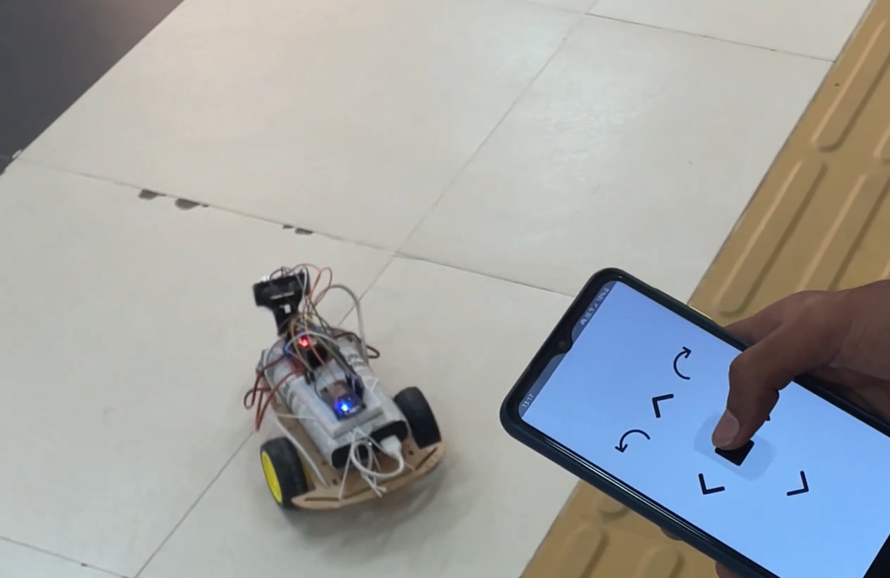

# CommandCruiser: IoT Rover with MQTT Communication and Smart Obstacle Avoidance

The CommandCruiser is an exciting IoT project that showcases the seamless communication, smart obstacle avoidance, and intuitive control capabilities of a two-wheeled Arduino car. Powered by the ESP8266, this rover can be controlled using a custom Android app developed in Kotlin, enabling real-time interaction and engagement.

## Table of Contents

- [Introduction](#introduction)
- [Features](#features)
- [Getting Started](#getting-started)
  - [Prerequisites](#prerequisites)
  - [Installation](#installation)
- [Usage](#usage)
  - [Connecting to the MQTT Broker](#connecting-to-the-mqtt-broker)
  - [Controlling the Rover](#controlling-the-rover)
  - [Obstacle Avoidance](#obstacle-avoidance)
- [Contributing](#contributing)
- [License](#license)

## Introduction

The CommandCruiser is a two-wheeled Arduino car designed to demonstrate the capabilities of IoT and robotics projects. It is equipped with an ESP8266 microcontroller for communication and control, ultrasonic sensors for obstacle detection, and a servo for smart obstacle avoidance. The project comprises two main components: the rover itself and an Android app for intuitive control.

## Features

- **MQTT Communication**: The CommandCruiser communicates seamlessly with the Android app using the MQTT protocol. It subscribes to a specific topic on a local EMQX MQTT Broker, ensuring real-time and reliable communication between the rover and the app.

- **Android App Control**: The Android app, developed in Kotlin, establishes a connection with the local MQTT broker and allows users to control the rover's movements intuitively. It sends MQTT messages to the rover to command actions such as forward, backward, left, and right.

- **Real-time Interaction**: The Android app provides a user-friendly interface for controlling the rover. The real-time interaction enhances the user experience and makes controlling the rover both engaging and enjoyable.

- **Smart Obstacle Avoidance**: Equipped with ultrasonic sensors and a servo, the CommandCruiser can autonomously detect obstacles and navigate around them. The obstacle avoidance algorithm involves measuring distances using the ultrasonic sensor, rotating the servo to gather information, and choosing the best direction to avoid obstacles.

## Getting Started

### Prerequisites

- Platform IO Vscode
- Android Studio for app development
- MQTT Broker (local or remote, EMQX)

### Installation

1. Clone the repository: `git clone https://github.com/Muthu-Palaniyappan-OL/command_cruiser.git`
2. Upload the Arduino code (`arduino/`) to the ESP8266 microcontroller using the VSCode Platform IO.
3. Open the Android app project in Android Studio (`android/` directory).
4. Configure the MQTT broker settings in the app code.
5. Build and install the Android app on your device.

## Usage

### Connecting to the MQTT Broker

1. Launch the Android app on your device.
2. Enter the MQTT broker's address and port in the app's settings.
3. Establish a connection to the MQTT broker.

### Controlling the Rover

1. Use the app's interface to send MQTT messages for controlling the rover's movements:
   - 'f' for forward
   - 'b' for backward
   - 'l' for left
   - 'r' for right

### Obstacle Avoidance

1. The rover's ultrasonic sensors detect obstacles in front of it.
2. If an obstacle is detected within a threshold distance, the rover engages the obstacle avoidance algorithm.
3. The rover rotates its servo left and right to measure distances in those directions.
4. After gathering information, the rover moves slightly backward.
5. The rover selects the direction with the most space (longer distance) and navigates to avoid the obstacle.

## Contributing

We welcome contributions to the CommandCruiser project. Feel free to submit issues and pull requests to improve the code, enhance features, or fix bugs.

## License

This project is licensed under the [MIT License](LICENSE).

---

Experience the potential of IoT and robotics with the CommandCruiser! Its MQTT communication, smart obstacle avoidance, and user-friendly Android app showcase the exciting possibilities of modern technology. For more details, visit our [GitHub repository](https://github.com/Muthu-Palaniyappan-OL/command_cruiser).

For inquiries, contact us at muthu892542@gmail.com, We look forward to your feedback and collaboration!
